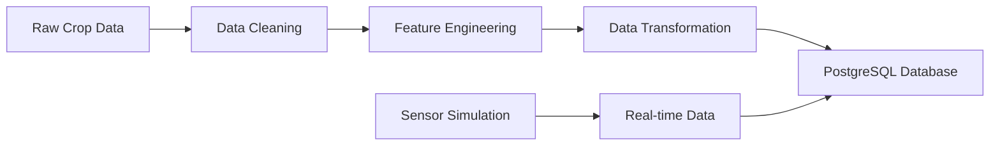

# 🌾 Intelligent Crop Monitoring System

An automated data pipeline system for crop monitoring and recommendation using machine learning and IoT sensor data simulation. This system processes agricultural data, performs data cleaning and transformation, and stores the results in a PostgreSQL database for analysis and crop recommendations.

## 📋 Table of Contents

- [Features](#features)
- [Project Structure](#project-structure)
- [Prerequisites](#prerequisites)
- [Installation](#installation)
- [Configuration](#configuration)
- [Usage](#usage)
- [Data Pipeline](#data-pipeline)
- [Database Schema](#database-schema)
- [API Endpoints](#api-endpoints)
- [Contributing](#contributing)
- [License](#license)

## ✨ Features

- **Data Processing Pipeline**: Automated ETL pipeline for crop recommendation data
- **IoT Sensor Simulation**: Real-time sensor data generation for soil moisture, temperature, and humidity
- **Data Cleaning & Transformation**: Advanced data preprocessing with feature engineering
- **PostgreSQL Integration**: Secure cloud database storage using Supabase
- **Crop Recommendation**: ML-ready dataset with categorized features for yield prediction
- **Real-time Monitoring**: Continuous sensor data collection and storage

## 📁 Project Structure

```
Intelligent Crop Monitering/
│
├── 📊 Data Files
│   ├── crop_data.csv                    # Raw crop recommendation dataset
│   ├── transformed_crop_data.csv        # Cleaned and transformed data
│   ├── daily_avg_sensor_data.csv        # Aggregated sensor readings
│   └── cleaned_sensor_data.csv          # Processed sensor data
│
├── 🔧 Core Scripts
│   ├── pipeline_runner.py               # Main ETL pipeline orchestrator
│   ├── data_cleaning.py                 # Data preprocessing and feature engineering
│   ├── csv_loader.py                    # Database loading utilities
│   ├── database.py                      # Database connection configuration
│   ├── sensor_simulator.py              # IoT sensor data simulation
│   └── web_scraper.py                   # Data generation utilities
│
├── 📦 Configuration
│   ├── requirements.txt                 # Python dependencies
│   └── README.md                        # Project documentation
```

## 🔧 Prerequisites

- Python 3.8+
- PostgreSQL database (Supabase account recommended)
- Internet connection for database operations

## 🚀 Installation

1. **Clone the repository**
   ```bash
   git clone https://github.com/DicksonLegend/Intelligent-Crop-Monitoring-System.git
   cd "Intelligent Crop Monitering"
   ```

2. **Create a virtual environment**
   ```bash
   python -m venv crop_monitoring_env
   
   # Windows
   crop_monitoring_env\Scripts\activate
   
   # macOS/Linux
   source crop_monitoring_env/bin/activate
   ```

3. **Install dependencies**
   ```bash
   pip install -r requirements.txt
   ```

## ⚙️ Configuration

### Database Setup

1. **Supabase PostgreSQL Configuration**
   - Update `database.py` with your Supabase credentials:
   ```python
   DB_USER = "your_username"
   DB_PASS = "your_password" 
   DB_HOST = "your_supabase_host"
   DB_NAME = "your_database_name"
   ```

2. **Environment Variables (Recommended)**
   Create a `.env` file:
   ```env
   DB_USER=your_username
   DB_PASS=your_password
   DB_HOST=your_supabase_host
   DB_PORT=5432
   DB_NAME=postgres
   ```

## 🎯 Usage

### Running the Complete Pipeline

Execute the main ETL pipeline:

```bash
python pipeline_runner.py
```

This will:
1. Clean and transform the raw crop data
2. Load processed data into PostgreSQL database
3. Generate feature-engineered columns for ML analysis

### Individual Components

**1. Data Cleaning & Transformation**
```bash
python data_cleaning.py
```

**2. Database Loading**
```bash
python csv_loader.py
```

**3. Sensor Data Simulation**
```bash
python sensor_simulator.py
```

**4. Generate Sample Data**
```bash
python web_scraper.py
```

## 🔄 Data Pipeline

### Data Processing Flow



### Feature Engineering

The system automatically generates the following features:

- **Nutrient Score**: Combined NPK (Nitrogen + Phosphorus + Potassium) values
- **Yield Category**: Low/Medium/High based on nutrient richness
- **Temperature Category**: Low/Moderate/High temperature ranges
- **Rainfall Category**: Low/Medium/High precipitation levels

### Data Quality Assurance

- ✅ Missing value handling
- ✅ Duplicate removal
- ✅ Data type validation
- ✅ Outlier detection
- ✅ Standardized formatting

## 🗄️ Database Schema

### Crop Recommendation Table
```sql
CREATE TABLE crop_recommendation (
    nitrogen INTEGER,
    phosphorus INTEGER,
    potassium INTEGER,
    temperature FLOAT,
    humidity FLOAT,
    pH_value FLOAT,
    rainfall FLOAT,
    crop VARCHAR(50),
    nutrient_score INTEGER,
    yield_category VARCHAR(20),
    temp_category VARCHAR(20),
    rainfall_category VARCHAR(20)
);
```

### Sensor Readings Table
```sql
CREATE TABLE sensor_readings (
    id SERIAL PRIMARY KEY,
    sensor_id INTEGER,
    soil_moisture FLOAT,
    temperature FLOAT,
    humidity FLOAT,
    timestamp TIMESTAMP,
    soil_condition VARCHAR(50)
);
```

## 📊 Data Features

### Input Variables
- **Nitrogen (N)**: Soil nitrogen content (ppm)
- **Phosphorus (P)**: Soil phosphorus content (ppm)
- **Potassium (K)**: Soil potassium content (ppm)
- **Temperature**: Ambient temperature (°C)
- **Humidity**: Relative humidity (%)
- **pH Value**: Soil pH level
- **Rainfall**: Annual rainfall (mm)

### Target Variable
- **Crop**: Recommended crop type (Rice, Maize, Coffee, etc.)

### Generated Features
- **Nutrient Score**: NPK composite score
- **Yield Category**: Predicted yield potential
- **Temperature Category**: Climate classification
- **Rainfall Category**: Precipitation classification

## 🔍 Monitoring & Analytics

### Real-time Sensor Data
- Soil moisture monitoring
- Temperature tracking
- Humidity measurement
- Automated data collection every 5 seconds

### Data Quality Metrics
- Data completeness
- Value range validation
- Temporal consistency
- Statistical outlier detection

## 🛠️ Dependencies

```python
pandas==1.5.3
sqlalchemy==2.0.10
psycopg2-binary==2.9.6
```

## 🔐 Security Considerations

- Database credentials should be stored in environment variables
- SSL connections are enforced for database operations
- Input validation is implemented for all data processing functions

## 🚦 Error Handling

The system includes comprehensive error handling for:
- Database connection failures
- Data validation errors
- File I/O operations
- Network connectivity issues

## 📈 Performance Optimization

- Batch processing for large datasets
- Efficient SQL queries with proper indexing
- Memory-optimized pandas operations
- Connection pooling for database operations

## 🔮 Future Enhancements

- [ ] Machine Learning model integration
- [ ] Web dashboard for data visualization
- [ ] REST API for external integrations
- [ ] Real-time alerting system
- [ ] Mobile application support
- [ ] Advanced analytics and reporting

## 🤝 Contributing

1. Fork the repository
2. Create a feature branch (`git checkout -b feature/AmazingFeature`)
3. Commit your changes (`git commit -m 'Add some AmazingFeature'`)
4. Push to the branch (`git push origin feature/AmazingFeature`)
5. Open a Pull Request

## 📄 License

This project is licensed under the MIT License - see the [LICENSE](LICENSE) file for details.

## 👨‍💻 Author

**Dickson Legend**
- GitHub: [@DicksonLegend](https://github.com/DicksonLegend)
- Project: [Intelligent-Crop-Monitoring-System](https://github.com/DicksonLegend/Intelligent-Crop-Monitoring-System)

## 📞 Support

For support and questions:
- Create an issue in the GitHub repository
- Contact the development team

---

⭐ **Star this repository if you find it helpful!**

Built with ❤️ for sustainable agriculture and smart farming initiatives.
